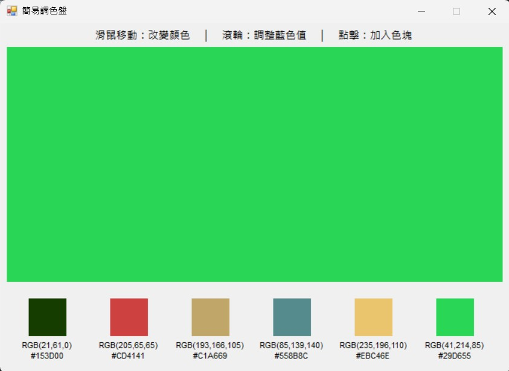
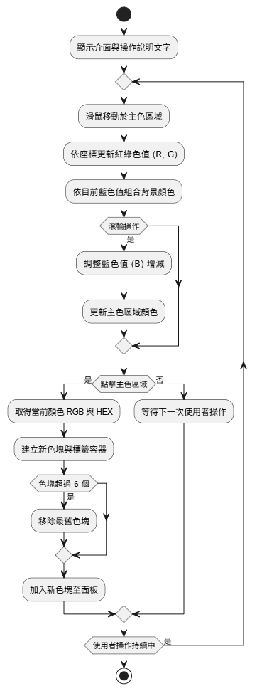

<h1 style="font-size: 28px;">Simple Palette - 簡易調色盤 (C# WinForms)</h1>

本專案為使用 C# Windows Forms 製作的互動式調色盤，透過滑鼠操作即可即時變更顏色，並可儲存選取的色彩資訊。

使用者可透過滑鼠移動與滾輪操作自由混合 R、G、B 三通道的顏色，點擊儲存並展示於下方色塊區。

<h2 style="font-size: 20px;">系統畫面展示</h2>

  

<h2>功能介紹與實作邏輯</h2>
<ul>
  <li>
    <strong>1. RGB 色彩互動</strong> 
    - 滑鼠移動於主面板上：動態改變紅色（X軸）與綠色（Y軸） 
    - 滑鼠滾輪上下捲動：調整藍色值 
    - 實現 0~255 的三通道色彩組合
  </li>
  <li>
    <strong>2. 色塊儲存與資訊顯示</strong> 
    - 點擊主面板即可儲存當前顏色 
    - 每組色塊會以 Panel 顯示顏色，並搭配下方 Label 顯示 RGB 與 HEX 色碼 
    - 最多顯示 6 組，超過後會自動移除最早的
  </li>
  <li>
    <strong>3. 操作提示與防呆處理</strong> 
    - 顯示文字提示操作方式（滑鼠移動、滾輪、點擊） 
    - 藍色值限制於 0~255，避免例外錯誤
  </li>
</ul>

<h2>使用技術</h2>
<ul>
  <li>介面設計：Panel、FlowLayoutPanel、Label 控制項組合排版</li>
  <li>事件控制：MouseMove 取得滑鼠位置轉為 RGB 值、MouseWheel 控制藍色通道、Click 儲存顏色</li>
  <li>顏色處理：使用 <code>Color.FromArgb</code> 動態生成顏色，<code>ToString("X2")</code> 轉換為 HEX 色碼</li>
</ul>

<h2>系統流程圖</h2>

